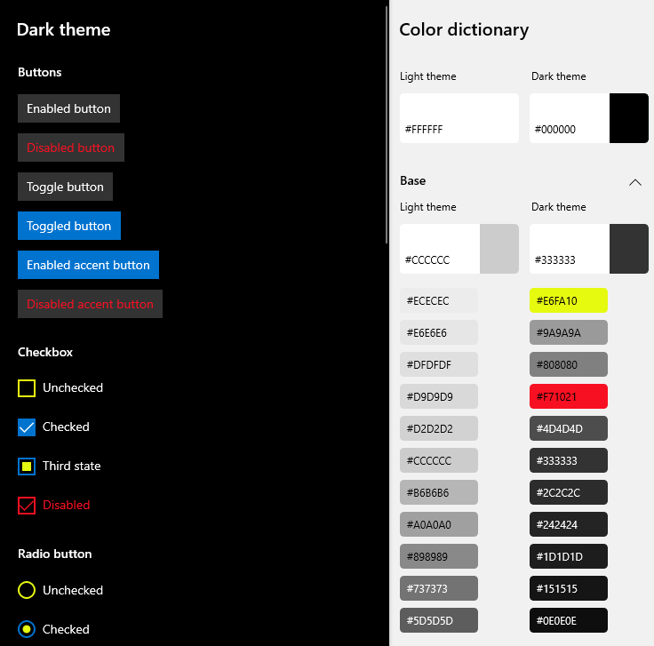
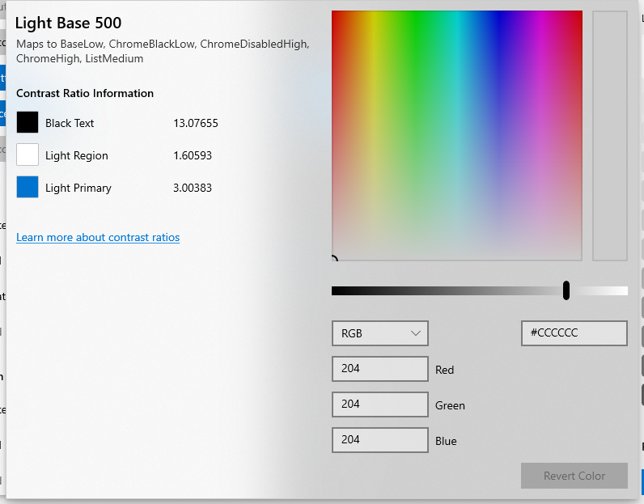
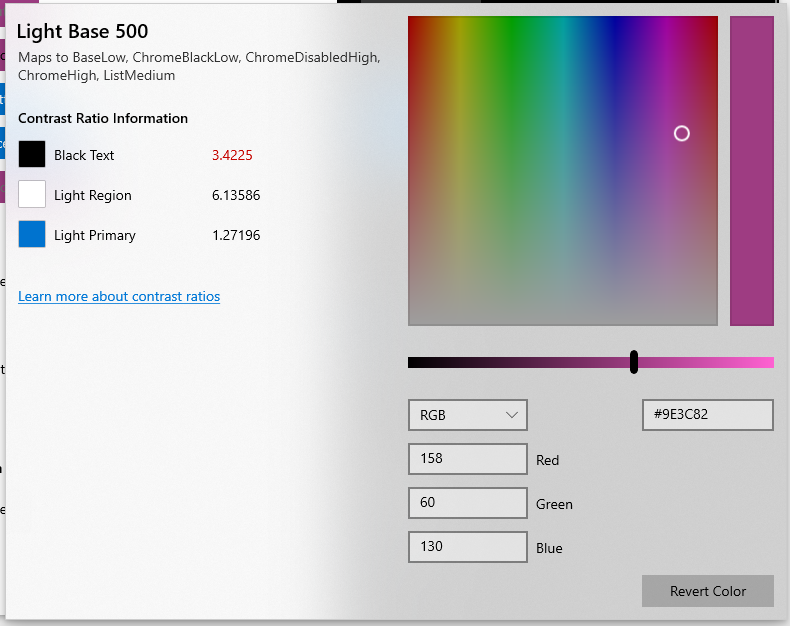

---
page_type: sample
name: Fluent Xaml Theme Editor
languages:
  - csharp
  - xaml
products:
  - windows
  - windows-uwp
description: A tool and sample app that shows you how to theme your app effortlessly. Jumpstarting this by also giving you lightweight toolability to see your custom theme come to life in your app.
---

Fluent XAML Theme Editor 
===


This repo contains the full solution and source code to the Fluent XAML Theme Editor - a tool that helps demonstrate the flexibility of the [Fluent Design System](https://www.microsoft.com/design/fluent/) as well as supports the app development process by generating XAML markup for our ResourceDictionary framework used in Universal Windows Platform (UWP) applications.

The source code located in this repo was created with the Universal Windows Platform available in Visual Studio and is designed to run on desktop, mobile and future devices that support the Universal Windows Platform.

> **Note:** If you are unfamiliar with XAML, the Universal Windows Platform, Fluent Design or resources and ResourceDictionaries, it is highly recommended that you visit the [Design Universal Windows Platform](https://developer.microsoft.com/en-us/windows/apps/design) site and familiarize yourself with the language and framework that this tool is intended for.

Universal Windows Platform development
---

This application requires Visual Studio 2017 Update 4 or higher and the Windows Software Development Kit (SDK) version 17763 or higher for Windows 10.

   [Get a free copy of Visual Studio 2017 Community Edition with support for building Universal Windows Platform apps](http://go.microsoft.com/fwlink/p/?LinkID=280676)

Additionally, to stay on top of the latest updates to Windows and the development tools, become a Windows Insider by joining the Windows Insider Program.

   [Become a Windows Insider](https://insider.windows.com/)
   
Store version of tool
---
If you're not looking to be apart of this open source project and instead would just like to use the app itself, please to go the Microsoft Store version of this tool and [download it there](https://www.microsoft.com/store/apps/9N2XD3Q8X57C).

How to use the tool
---
With the preview build, you can select three major colors for both the Light and Dark themes in the right-hand properties view labeled “Color Dictionary”.


 - **Region** – The background that all the controls sit on, which is a separate resource that does not exist in our framework.
 - **Base** – Represents all our controls’ backplates and their temporary state visuals like hover or press. In general, Base should be in contrast with the background (or Region color) of your theme and with black text (if in Light theme) and white text (if in Dark theme).
 - **Primary** – This is essentially the Accent color and should contrast with mainly white text. It is also used in more choice locations to show alternate rest states for toggled controls like list selection, checkbox or radiobutton checked states, slider fill values, and other control parts that need to be shown as different from their default rest state once interacted with.
 
Refining the colors
---
In addition to the three major colors for each theme, you can also expand any one of the major colors to see a list of minor colors that change the look of only certain control parts - this basically allows you to get more detailed with your color choices for states.



To access the detailed view of colors, simply click the chevron next to the major color button swatches.

Creating, saving and loading presets
---
The editor will ship with some presets for you to look at to get an idea of what a theme looks like in the app. The preset dropdown is located at the top of the Color Dictionary properties panel.

When you first boot up it will always be set to Default – which is the Light and Dark theme styling default for all our controls. You can select different themes like Lavender and Nighttime to get an idea of how the tool will theme our controls.

Once you’re ready to start making your own theme, just start editing the colors! Once you’ve started tweaking them, you’ll notice that the Presets ComboBox goes from the name of the preset to “Custom”:

This means that you’ve started a new temporary theme that’s “Custom.” Any changes you make will not affect any of the other Presets in that box.

 - Once you’re satisfied with the changes you’ve made, simply click the “Save” button and browse to your desired save point.
 - Similarly, you can open your saved JSON theme by clicking the “Load” button and browsing to your saved theme’s file location.
 
Checking contrast ratio
---
The last part of the theme editor is probably one of the most important parts of creating your theme, and that is to make sure that in either respective theme you are contrast compliant. The tool provides you with a small list of contrast information on the left-hand side of the color selection window when choosing your color.



In this window you can see your contrast with the most prevalent text color in the theme that you’re choosing to edit, in the above case black text because you are editing a Light theme color value.

When you pick a color that falls below the standard contrast ratio of **4.5:1**, you’ll be alerted with red text next to your contrast value.



You can learn more about [contrast ratios and their importance here](https://docs.microsoft.com/en-us/windows/uwp/design/accessibility/accessible-text-requirements).

Exporting and using your theme in a UWP app
---
Once you’ve themed everything, you’ll want to use it in your app! To do that you’ll need to click the “Export” button at the bottom of the Color Dictionary properties panel.


That button will open a popup window with a generic, unnamed ResourceDictionary stub (seen below).


This window doesn’t make anything final, however, if you want to make some changes to the theme and re-export them to the Export window, it will refresh with your changed color values.

However, once you’re ready to use it in your app, click the “Copy to Clipboard” button in the lower right corner and go to UWP Visual Studio solution.

Once in Visual Studio, right-click on the project solution, located in the Solution Explorer.


And go to Add > New Item and then choose Resource Dictionary.


Name that dictionary whatever makes sense to you and click Add when you’re done.


That should generate a blank ResourceDictionary like this:

```xaml
<ResourceDictionary
    xmlns="http://schemas.microsoft.com/winfx/2006/xaml/presentation"
    xmlns:x="http://schemas.microsoft.com/winfx/2006/xaml"
    xmlns:local="using:MyAppName">
    
</ResourceDictionary>
```

Now you can paste the exported theme code from the editor into that ResourceDictionary.

```xaml
<ResourceDictionary
    xmlns="http://schemas.microsoft.com/winfx/2006/xaml/presentation"
    xmlns:x="http://schemas.microsoft.com/winfx/2006/xaml"
    xmlns:local="using:MyAppName">
    
    <!-- Free Public License 1.0.0 Permission to use, copy, modify, and/or distribute this code for any purpose with or without fee is hereby granted. -->
    <ResourceDictionary.ThemeDictionaries>
        <ResourceDictionary x:Key="Default">
            <ResourceDictionary.MergedDictionaries>
                <ColorPaletteResources Accent="#FF0073CF" AltHigh="#FF000000" AltLow="#FF000000" AltMedium="#FF000000" AltMediumHigh="#FF000000" AltMediumLow="#FF000000" BaseHigh="#FFFFFFFF" BaseLow="#FF333333" BaseMedium="#FF9A9A9A" BaseMediumHigh="#FFB4B4B4" BaseMediumLow="#FF676767" ChromeAltLow="#FFB4B4B4" ChromeBlackHigh="#FF000000" ChromeBlackLow="#FFB4B4B4" ChromeBlackMedium="#FF000000" ChromeBlackMediumLow="#FF000000" ChromeDisabledHigh="#FF333333" ChromeDisabledLow="#FF9A9A9A" ChromeGray="#FF808080" ChromeHigh="#FF808080" ChromeLow="#FF151515" ChromeMedium="#FF1D1D1D" ChromeMediumLow="#FF2C2C2C" ChromeWhite="#FFFFFFFF" ListLow="#FF1D1D1D" ListMedium="#FF333333" />
                <ResourceDictionary>
                    <Color x:Key="SystemChromeAltMediumHighColor">#CC000000</Color>
                    <Color x:Key="SystemChromeAltHighColor">#FF000000</Color>
                    <Color x:Key="SystemRevealListLowColor">#FF1D1D1D</Color>
                    <Color x:Key="SystemRevealListMediumColor">#FF333333</Color>
                    <Color x:Key="RegionColor">#FF000000</Color>
                    <SolidColorBrush x:Key="RegionBrush" Color="{StaticResource RegionColor}" />
                </ResourceDictionary>
            </ResourceDictionary.MergedDictionaries>
        </ResourceDictionary>
        <ResourceDictionary x:Key="Light">
            <ResourceDictionary.MergedDictionaries>
                <ColorPaletteResources Accent="#FF0073CF" AltHigh="#FFFFFFFF" AltLow="#FFFFFFFF" AltMedium="#FFFFFFFF" AltMediumHigh="#FFFFFFFF" AltMediumLow="#FFFFFFFF" BaseHigh="#FF000000" BaseLow="#FFCCCCCC" BaseMedium="#FF898989" BaseMediumHigh="#FF5D5D5D" BaseMediumLow="#FF737373" ChromeAltLow="#FF5D5D5D" ChromeBlackHigh="#FF000000" ChromeBlackLow="#FFCCCCCC" ChromeBlackMedium="#FF5D5D5D" ChromeBlackMediumLow="#FF898989" ChromeDisabledHigh="#FFCCCCCC" ChromeDisabledLow="#FF898989" ChromeGray="#FF737373" ChromeHigh="#FFCCCCCC" ChromeLow="#FFECECEC" ChromeMedium="#FFE6E6E6" ChromeMediumLow="#FFECECEC" ChromeWhite="#FFFFFFFF" ListLow="#FFE6E6E6" ListMedium="#FFCCCCCC" />
                <ResourceDictionary>
                    <Color x:Key="SystemChromeAltMediumHighColor">#CCFFFFFF</Color>
                    <Color x:Key="SystemChromeAltHighColor">#FFFFFFFF</Color>
                    <Color x:Key="SystemRevealListLowColor">#FFE6E6E6</Color>
                    <Color x:Key="SystemRevealListMediumColor">#FFCCCCCC</Color>
                    <RevealBackgroundBrush x:Key="SystemControlHighlightListLowRevealBackgroundBrush" TargetTheme="Light" Color="{ThemeResource SystemRevealListMediumColor}" FallbackColor="{ StaticResource SystemListMediumColor}" />
                    <Color x:Key="RegionColor">#FFFFFFFF</Color>
                    <SolidColorBrush x:Key="RegionBrush" Color="{StaticResource RegionColor}" />
                </ResourceDictionary>
            </ResourceDictionary.MergedDictionaries>
        </ResourceDictionary>
        <ResourceDictionary x:Key="HighContrast">
            <StaticResource x:Key="RegionColor" ResourceKey="SystemColorWindowColor" />
            <SolidColorBrush x:Key="RegionBrush" Color="{StaticResource RegionColor}" />
        </ResourceDictionary>
    </ResourceDictionary.ThemeDictionaries>
    
</ResourceDictionary>
```
Now you have a fully customized color theme waiting to be use, so let’s apply it!

To do that, you’ll want to go into your page or app.xaml (depending on how much of your app you want the theme to apply to) and merge your theme dictionary into the resources of that page or app.

```xaml
<Page.Resources>
   <ResourceDictionary>
      <ResourceDictionary.MergedDictionaries>
         <ResourceDictionary Source="PurpleGreenTheme.xaml"/>
      </ResourceDictionary.MergedDictionaries>
   </ResourceDictionary>
</Page.Resources>
```

Lastly, don’t forget to set the background color of your page to the RegionColor that you picked for your theme. It’s the only brush that won’t get set automatically.

```xaml
<Grid Background="{ThemeResource RegionBrush}">
   <!-- Your page layout/content here -->
</Grid>
```

Once that’s in, you’re done! Your theme colors will now be pervasive across your app or page depending.

Using ColorPaletteResources in code-behind
---
To access the ColorPaletteResources API in code behind, and to change any of the color properties at runtime, loop through the merged dictionaries in app.xaml (or at the scope that you merged your themes) and grab a reference to the currently used ResourceDictionary as a ColorPaletteResource instance

Here's an example of how to grab and edit the properties on ColorPaletteResources in C#:
```C#
public MainPage()
{
    this.InitializeComponent();

    ColorPaletteResources cpr = FindColorPaletteResourcesForTheme("Light");
    cpr.Accent = Colors.Red;

    ReloadPageTheme(this.RequestedTheme);
}

private void ReloadPageTheme(ElementTheme startTheme)
{
    if (this.RequestedTheme == ElementTheme.Dark)
        this.RequestedTheme = ElementTheme.Light;
    else if (this.RequestedTheme == ElementTheme.Light)
        this.RequestedTheme = ElementTheme.Default;
    else if (this.RequestedTheme == ElementTheme.Default)
        this.RequestedTheme = ElementTheme.Dark;

    if (this.RequestedTheme != startTheme)
        ReloadPageTheme(startTheme);
}

private ColorPaletteResources FindColorPaletteResourcesForTheme(string theme)
{
    foreach (var themeDictionary in Application.Current.Resources.ThemeDictionaries)
    {
        if (themeDictionary.Key.ToString() == theme)
        {
            if (themeDictionary.Value is ColorPaletteResources)
            {
                return themeDictionary.Value as ColorPaletteResources;
            }
            else if (themeDictionary.Value is ResourceDictionary targetDictionary)
            {
                foreach (var mergedDictionary in targetDictionary.MergedDictionaries)
                {
                    if (mergedDictionary is ColorPaletteResources)
                    {
                        return mergedDictionary as ColorPaletteResources;
                    }
                }
            }
        }
    }
    return null;
}
```
We don't recommend doing this too often at runtime as you could experience some performance issues, but if placed in a Settings page or areas where you don't expect users to toggle it often, the performance shouldn't be too bad.

> **Tip!** You need to reload a ResourceDictionary in order for the resources within to get any new color changes you've applied. You can do so by flipping the RequestedTheme to a different theme and back again. That is what the ReloadPageTheme function is doing.

Theming for Downlevel
---
Although the API used in the exported code for this tool is for version 17744 or greater, it's not too complicated to get your theme to work on earlier SDK versions.

When you export your theme, you'll see a ResourceDictionary markup with a ColorPaletteResources definition similar to this:

```xaml
<ResourceDictionary.ThemeDictionaries>
    <ResourceDictionary x:Key="Default">
        <ResourceDictionary.MergedDictionaries>
            <ColorPaletteResources Accent="#FF8961CC" AltHigh="#FF000000" AltLow="#FF000000" AltMedium="#FF000000" AltMediumHigh="#FF000000" AltMediumLow="#FF000000" BaseHigh="#FFFFFFFF" BaseLow="#FF64576B" BaseMedium="#FFB6AABC" BaseMediumHigh="#FFCBBFD0" BaseMediumLow="#FF8D8193" ChromeAltLow="#FFCBBFD0" ChromeBlackHigh="#FF000000" ChromeBlackLow="#FFCBBFD0" ChromeBlackMedium="#FF000000" ChromeBlackMediumLow="#FF000000" ChromeDisabledHigh="#FF64576B" ChromeDisabledLow="#FFB6AABC" ChromeGray="#FFA295A8" ChromeHigh="#FFA295A8" ChromeLow="#FF332041" ChromeMedium="#FF3F2E4B" ChromeMediumLow="#FF584960" ChromeWhite="#FFFFFFFF" ListLow="#FF3F2E4B" ListMedium="#FF64576B" />
        <ResourceDictionary>
            <Color x:Key="RegionColor">#FF262738</Color>
            <SolidColorBrush x:Key="RegionBrush" Color="{StaticResource RegionColor}" />
        </ResourceDictionary>
    </ResourceDictionary.MergedDictionaries>
</ResourceDictionary>
```

ColorPaletteResources is a friendly API for our SystemColors that sit within generic.xaml and allows for those SystemColors to be scoped at any level. 

If you wanted to enable this same theme to work downlevel, you would have to define each SystemColor individually with each color from your theme:

```xaml
<ResourceDictionary>
    <ResourceDictionary.ThemeDictionaries>
        <ResourceDictionary x:Key="Default">
            <Color x:Key="SystemAltHighColor">#FF000000</Color>
            <Color x:Key="SystemAltLowColor">#FF000000</Color>
            <Color x:Key="SystemAltMediumColor">#FF000000</Color>
            <Color x:Key="SystemAltMediumHighColor">#FF000000</Color>
            <Color x:Key="SystemAltMediumLowColor">#FF000000</Color>
            <Color x:Key="SystemBaseHighColor">#FFFFFFFF</Color>
            <Color x:Key="SystemBaseLowColor">#FF64576B</Color>
            <Color x:Key="SystemBaseMediumColor">#FFB6AABC</Color>
            <Color x:Key="SystemBaseMediumHighColor">#FFCBBFD0</Color>
            <Color x:Key="SystemBaseMediumLowColor">#FF8D8193</Color>
            <Color x:Key="SystemChromeAltLowColor">#FFCBBFD0</Color>
            <Color x:Key="SystemChromeBlackHighColor">#FF000000</Color>
            <Color x:Key="SystemChromeBlackLowColor">#FFCBBFD0</Color>
            <Color x:Key="SystemChromeBlackMediumLowColor">#FF000000</Color>
            <Color x:Key="SystemChromeBlackMediumColor">#FF000000</Color>
            <Color x:Key="SystemChromeDisabledHighColor">#FF64576B</Color>
            <Color x:Key="SystemChromeDisabledLowColor">#FFB6AABC</Color>
            <Color x:Key="SystemChromeHighColor">#FFA295A8</Color>
            <Color x:Key="SystemChromeLowColor">#FF332041</Color>
            <Color x:Key="SystemChromeMediumColor">#FF3F2E4B</Color>
            <Color x:Key="SystemChromeMediumLowColor">#FF584960</Color>
            <Color x:Key="SystemChromeWhiteColor">#FFFFFFFF</Color>
            <Color x:Key="SystemChromeGrayColor">#FFA295A8</Color>
            <Color x:Key="SystemListLowColor">#FF3F2E4B</Color>
            <Color x:Key="SystemListMediumColor">#FF64576B</Color>                
            <Color x:Key="SystemAccentColor">#FF8961CC</Color>
            
            <Color x:Key="RegionColor">#FF262738</Color>
            <SolidColorBrush x:Key="RegionBrush" Color="{StaticResource RegionColor}"/>
         </ResourceDictionary>
    </ResourceDictionary.ThemeDictionaries>
</ResourceDictionary>
```
In this case we're using the Lavendar theme to show this downlevel transition.

> **Warning:** Although this markup format change will enable your theme to be applied across controls in earlier SDK versions, it **will not** work on a page, container or control scoped level. ColorPaletteResources is the API that allows **scoping behavior**. This markup format will only work at the app.xaml level for earlier SDKs.

Contributions
---
This tool was created directly from the feature team and although we welcome your input and suggestions for improvements to the tool, we are not accepting any features or changes from the public at this time. Please check back regularly as we may evolve our contribution model in the future.

This project has adopted the [Microsoft Open Source Code of Conduct](https://opensource.microsoft.com/codeofconduct/). For more information, see the [Code of Conduct FAQ](https://opensource.microsoft.com/codeofconduct/faq/) or contact [opencode@microsoft.com](mailto:opencode@microsoft.com) with any additional questions or comments.

See also
---

For additional Windows source code, tools and samples, please see [Windows on GitHub](http://microsoft.github.io/windows/). 
